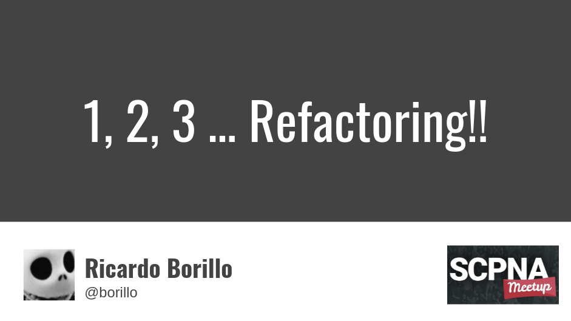

## ✅ Intro

- 💡 Refactoring con equipos: MOB programming.
- 💡 Principios de backend en frontend.
- 🎥 [Programación funcional: Próximamente en un lenguaje de programación cerca de usted](https://www.youtube.com/watch?v=y0GwxCDTJvA)
- 🧠 Estudiando programación funcional.
- 💡 TypeScript.

## ✅ Estructura del proyecto

- 🧠 Domain-Driven Design:
  - **Strategic Design**: Ubiquitous Language, Context Mapping, Event Storming, etc.
  - **Tactical Design**: OOP + Aggregates.
- 🎥 [Functional architecture - The pits of success](https://www.youtube.com/watch?v=US8QG9I1XW0)
- 📖 Domain modeling made functional (Scott Wlaschin).
- 💡 Estructura técnica vs estructura funcional:
  - Un primer nivel por cada dominio.
  - Misma abstracción en varios dominios.

## ✅ Foco en los “value objects”

- 🧠 Tell, don't ask. Ley de Demeter.
- 💩 Código duplicado + Falta de niveles de abstracción.
- 💡 Previo al refactoring de diseño. Primero semántica y naming.
- 💡 Foco atractor de código.
- 💩 utils & helpers.
- 🚀 Encapsulación de colecciones (💩 Código duplicado + Acoplamiento).

## ✅ Manejo de la opcionalidad

- 💡 Computación que puede fallar.
- 💩 Programación defensiva (`Optional chaining` or `Nullish coalescing operator`).
- 💡 NullObject pattern.
- 🧠 Functional programming: `fp-ts`.

## ✅ Manejo de excepciones

- 💩 Programación defensiva.
- 💩 Enfoque tradicional:
  - Paso de mensajes.
  - Ruptura del flujo + exception handler global.
  - Falta de contexto.
  - No accionables. Excepciones ignoradas/silenciadas.
- 💡 Lo convertimos en un `value`.
- 🧠 Functional programming: `fp-ts`.

## ✅ Decoración

- 💩 Separación de responsabilidades: audit, logging, caching.
- 💡 Permiten componerse.
- 💡 Métodos factoría para generar las decoraciones.
- 💡 Configurable en test para evitar por ejemplo el caching.

# ❔ Q&A

> Ricardo Borillo

> borillo@gmail.com

> https://twitter.com/borillo
